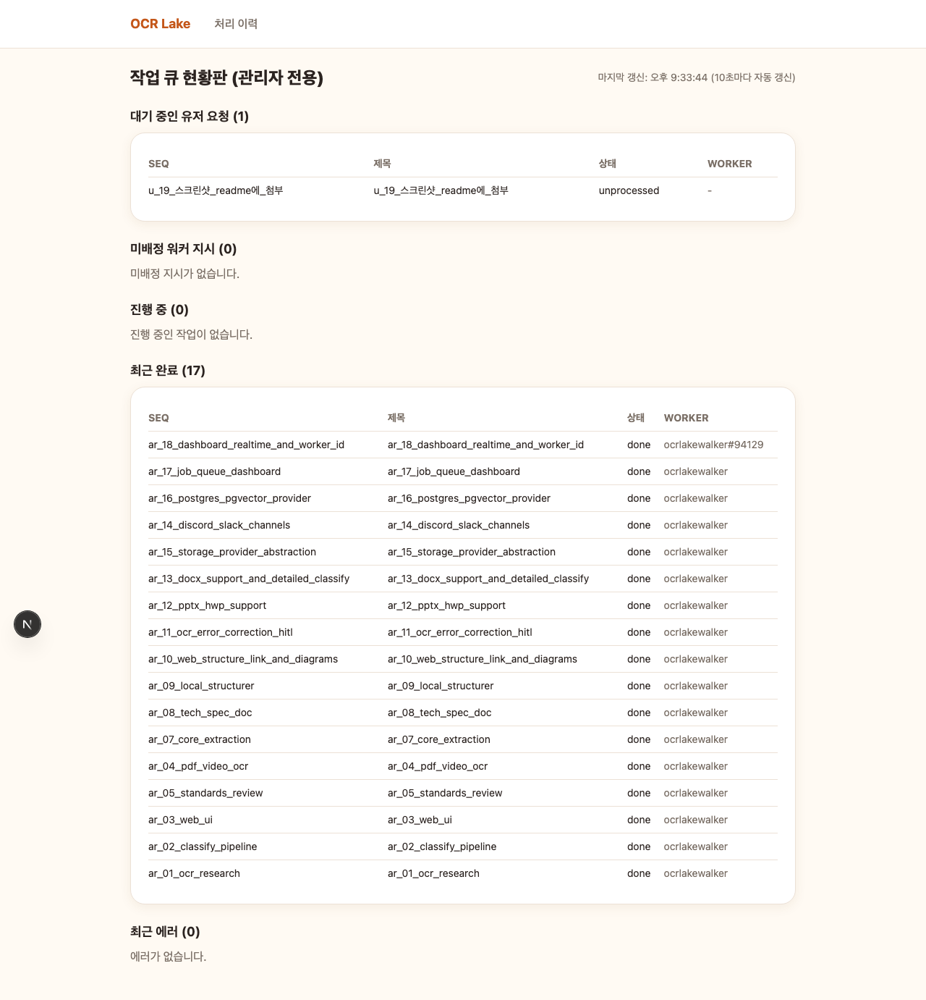

# ocr-lake

텔레그램 봇 또는 웹 화면(FastAPI + Next.js)으로 문서·이미지·동영상을 받아 텍스트를 추출·구조화하고, 처리 이력을 조회하는 프로젝트입니다.

## 지원 포맷

| 분류 | 포맷 | 처리 방식 |
|---|---|---|
| 이미지 | JPEG, PNG, WEBP, BMP, TIFF | Tesseract OCR |
| 문서(스캔형) | PDF | 페이지별 이미지 렌더링 → OCR |
| 동영상 | MP4, MOV, WEBM, AVI | 2.5초 간격 프레임 샘플링 → OCR |
| 오피스 문서 | PPTX, DOCX | 텍스트박스/단락 직접 추출(OCR 불필요) |
| 아래아한글 | HWP | `hwp-hwpx-parser`로 텍스트 직접 추출 |

`.doc`(구버전 바이너리)은 아직 미지원입니다.

## 지원 채널

| 채널 | 상태 | 비고 |
|---|---|---|
| 텔레그램 | 구현+운영중 | `telegram_bot/` |
| 웹(FastAPI+Next.js) | 구현+운영중 | `web/` |
| Discord | 코드 완성, 실연동 미검증 | `discord_bot/` — `DISCORD_BOT_TOKEN` 발급 후 `python3 -m discord_bot.bot` |
| Slack | 코드 완성, 실연동 미검증 | `slack_bot/` — `SLACK_BOT_TOKEN`·`SLACK_SIGNING_SECRET` 발급 후 `python3 -m slack_bot.bot` |

Discord/Slack은 봇 토큰이 아직 발급되지 않아 실제 서버 연동 테스트는 못 했다(유닛 테스트 레벨로만 검증 — 자세한 내용은 [기술 스펙 §14-3](./docs/tech-spec.md#14-3-채널-확장discordslack-구현됨코드-완성--실-서버-연동은-유저-액션-필요)).

## 장점 · 단점

**장점**
- 텔레그램·웹 두 채널이 완전히 같은 처리 로직(`core/`)을 공유해 어느 쪽으로 넣어도 결과가 동일하다.
- OCR 없이 텍스트를 직접 뽑을 수 있는 포맷(PPTX/DOCX/HWP)은 OCR을 건너뛰어 정확도 100%·처리 비용 최소화.
- 구조화 파싱(영수증/명함 등)이 클라우드 API가 아닌 로컬 MLX 모델이라 API 비용·외부 전송 없이 처리 가능(Apple Silicon 네이티브 가속).
- 문서 유형 세분류가 키워드 휴리스틱 우선이라 대부분의 경우 무거운 모델 호출 없이 빠르게 판별.

**단점 / 한계**
- OCR(Tesseract) 자체 정확도는 클라우드 OCR(AWS Textract, Azure Document Intelligence 등)보다 낮다 — 특히 손글씨·복잡한 표는 취약.
- 손글씨·사인·사물 사진에 대한 이미지 설명(비전 모델)은 아직 스텁 상태로 실사용 불가.
- OCR 오인식을 사람이 검수·수정하는 화면/워크플로우가 아직 없다(설계 문서만 존재, [`docs/planning/ocr-error-correction-design.md`](./docs/planning/ocr-error-correction-design.md) 참고).
- 로컬 MLX 모델 구동은 Apple Silicon 전용이라 다른 환경(Windows/Linux/Intel Mac)에서는 별도 조치가 필요하다.
- `.doc`(레거시 바이너리)은 아직 미지원. Discord/Slack은 코드는 완성됐으나(아래 채널 목록 참고) 실제 봇 등록·토큰 발급은 유저 액션이 필요해 라이브 연동 테스트는 아직 못 했다.

## 구성

- `core/`: 채널 무관 핵심 로직 — 이미지 유형 분류, OCR(Tesseract), PDF/동영상 처리, 저장소(SQLite), 분기 파이프라인, 로컬 LLM(MLX) 기반 구조화 파싱
- `telegram_bot/`: 텔레그램 채널 어댑터(봇 엔트리·핸들러) + 오케스트레이터 운영 인프라(`telegram_bot/orchestrator/`)
- `web/backend/`: FastAPI(업로드/이력 조회/구조화 API)
- `web/frontend/`: Next.js(업로드 화면·이력 목록·상세)
- `docs/`: 기술 스펙·리서치·아키텍처 다이어그램

## 워크플로우

1. **입력 수신**: 텔레그램(사진/PDF/동영상 메시지) 또는 웹 업로드(`POST /api/upload`)로 파일이 들어온다.
2. **유형 분류**: `core/classify/engine.py`가 Tesseract confidence·단어수 기반으로 `document`/`photo`/`ambiguous` 3단계로 판정한다.
3. **분기 처리**(`core/pipeline.py`):
   - `document` → OCR(Tesseract)로 텍스트 추출
   - `photo` → 이미지 설명(비전 모델, 현재 스텁) 경로로 폴백
   - PDF는 페이지별 렌더링 후, 동영상은 프레임 샘플링 후 위 파이프라인을 그대로 재사용
4. **저장**: 결과(텍스트·분류·원본 경로)를 SQLite(`core/storage/db.py`)에 영속화 — 텔레그램·웹 어느 경로로 들어와도 같은 테이블에 쌓인다.
5. **구조화(선택)**: 저장된 레코드를 `POST /api/records/{id}/structure`로 호출하면 로컬 MLX 모델(`core/ocr/structurer.py`)이 영수증/명함 등 문서 유형별 JSON 스키마로 재구조화해 같은 레코드에 저장한다.
6. **조회**: 웹 화면(`/`, `/records`, `/records/[id]`)에서 처리 이력을 목록·상세로 확인한다.

## 문서

- [기술 스펙(docs/tech-spec.md)](./docs/tech-spec.md) — 아키텍처, 모듈별 구현 상세, API 스펙, 로드맵. 현재 구현된 것과 앞으로 구현될 것을 배지로 구분해 정리했습니다.
- [소프트웨어 아키텍처 다이어그램](./docs/diagrams/software-architecture.svg)
- [시스템 구성·네트워크 연결도](./docs/diagrams/system-network.svg)
- [OCR 기술 동향 리서치](./docs/research/ocr-technology-trends.md)
- [OCR 기업 적용 사례 리서치](./docs/research/ocr-industry-applications.md)
- [모듈 표준 준수 감사](./docs/planning/standards/module-audit-2026-08-21.md)
- [로컬 LLM(MLX) 모델 선정 근거](./docs/planning/standards/local-model-selection.md)

### 관리자 대시보드(참고용 스크린샷)

`/admin`(기본 비활성 — `ADMIN_DASHBOARD_ENABLED=1` 설정 시 활성화, 일반 화면 네비게이션에는 노출되지 않음)에서 오케스트레이터 작업 큐(대기·진행중·완료·에러, 워커 식별자)를 10초 간격으로 실시간 조회할 수 있습니다.



## 실행

```bash
# 텔레그램 봇
pip install -r requirements.txt
python3 -m telegram_bot.bot

# 웹 백엔드
python3 -m uvicorn web.backend.main:app --reload --port 8000

# 웹 프론트
cd web/frontend && npm install && npm run dev
```

## 네트워크 구성 · 방화벽

실측(코드 grep) 기반 — 각 채널이 실제로 어느 방향으로 통신하는지 정리한다. 로컬/신뢰 환경(단일
사용자, 같은 머신) 전제이며, 별도 인증 계층은 아직 없다(security-guideline.md §17 참고).

### 서비스별 포트

| 서비스 | 포트 | 방향 | 비고 |
|---|---|---|---|
| Next.js 프론트(`web/frontend`) | 3000(기본), 자동 대체 3001 | inbound(로컬) | 브라우저 → 프론트 |
| FastAPI 백엔드(`web/backend`) | 8000 | inbound(로컬) | 프론트/curl → 백엔드. CORS로 3000·3001만 허용 |
| PostgreSQL(`STORAGE_PROVIDER=postgres`) | 5432 | inbound(로컬) | 백엔드/텔레그램 프로세스 → DB, 같은 머신 기준 |
| Slack Bolt(`slack_bot`, HTTP 모드) | 3010(기본, `SLACK_PORT`) | **inbound(외부)** | Slack 서버가 이벤트를 이 포트로 push — 로컬 개발 시 ngrok 등 터널 필요(`.env.example` 주석 참고) |
| Ollama(로컬 LLM, 참고용) | 11434 | inbound(로컬) | 이 프로젝트는 MLX(프로세스 내 추론)를 쓰므로 미사용 — 과거 검토 흔적만 존재 |

### 아웃바운드(이 서버 → 외부)

| 대상 | 포트/프로토콜 | 용도 |
|---|---|---|
| `api.telegram.org` | 443(HTTPS), long-polling | 텔레그램 봇 메시지 수신·응답(`telegram_bot/bot.py` — `run_polling`, inbound 포트 개방 불요) |
| Discord Gateway(`discord.com`) | 443(HTTPS)+WSS | Discord 봇 이벤트 수신(`discord_bot/bot.py` — `client.run()`, 웹소켓 아웃바운드 연결이라 inbound 포트 개방 불요) |
| `vision.googleapis.com` | 443(HTTPS) | Google Cloud Vision REST API 호출(자격증명 설정 시에만, `core/ocr/providers/google_provider.py`) |
| HuggingFace Hub(최초 1회) | 443(HTTPS) | MLX 모델 최초 다운로드 시에만(로컬 캐시 이후 오프라인 추론) |

### 인바운드(외부 → 이 서버)

| 발신처 | 포트 | 용도 |
|---|---|---|
| Slack 서버 | 3010(`SLACK_PORT`) | Slack 이벤트(`file_shared` 등) 웹훅 수신 — **활성화 시에만** 방화벽에서 열어야 함(로컬 개발은 ngrok 등으로 우회 가능) |
| (사용자 자신) 브라우저 | 3000/3001, 8000 | 로컬 웹 UI·API 접근 — 외부 공개 배포 시에만 방화벽 개방 검토 |

### 요약

- **텔레그램·Discord**: 아웃바운드 연결만 사용 — 방화벽에서 별도 inbound 포트를 열 필요 없음.
- **Slack**: 유일하게 inbound 포트(3010)가 필요한 채널 — 실 배포 시 리버스 프록시/방화벽 규칙 필요.
- **웹(Next.js+FastAPI)·PostgreSQL**: 같은 머신 내 로컬 통신 전제 — 외부 공개하려면 8000·5432를 별도로
  보호(리버스 프록시·방화벽 화이트리스트)해야 한다(현재 CORS만으로는 네트워크 레벨 차단이 아님).
- 상세 다이어그램: [`docs/diagrams/system-network.svg`](./docs/diagrams/system-network.svg)

## License

This project is distributed under the [PolyForm Noncommercial License 1.0.0](./LICENSE).

- **Personal / noncommercial use** (research, learning, hobby projects, nonprofits, educational institutions, etc.): free to use, modify, and distribute.
- **Commercial use** (companies, etc.): requires a separate commercial license agreement. Contact the repository maintainer to inquire.
