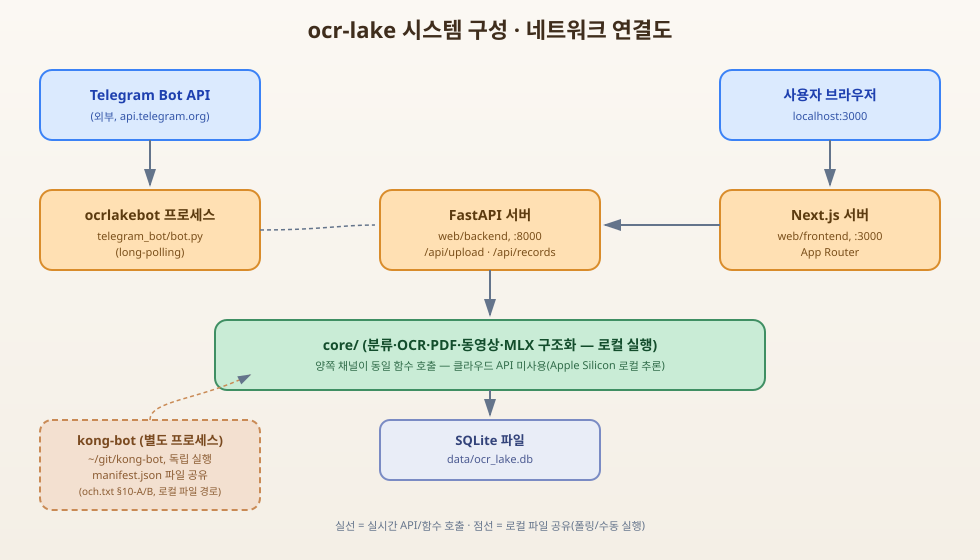

# ocr-lake 기술 스펙

> 실측 기반 문서(2026-08-22 시점 코드 실측). "구현됨" / "계획" 배지로 현재 상태와 로드맵을 명확히 구분한다.

## 목차

1. [아키텍처 개요](#1-아키텍처-개요)
2. [이미지 유형 분류 게이트](#2-이미지-유형-분류-게이트-구현됨)
3. [OCR 엔진](#3-ocr-엔진-구현됨)
4. [PDF 처리](#4-pdf-처리-구현됨)
5. [동영상 처리](#5-동영상-처리-구현됨)
6. [분기 파이프라인](#6-분기-파이프라인-구현됨)
7. [저장소(SQLite)](#7-저장소sqlite-구현됨)
8. [텔레그램 봇](#8-텔레그램-봇-구현됨)
9. [웹 API](#9-웹-apifastapi-구현됨)
10. [웹 프론트(Next.js)](#10-웹-프론트nextjs-구현됨)
11. [오케스트레이터 인프라](#11-오케스트레이터-인프라-구현됨)
12. [AI 구조화/비전 — 스텁 상태](#12-ai-구조화비전--스텁-상태-미구현)
13. [라이선스](#13-라이선스-구현됨)
14. [로드맵(앞으로 구현될 것)](#14-로드맵-앞으로-구현될-것)

---

## 1. 아키텍처 개요

`구현됨`

```
core/                채널 무관 핵심 로직(OCR·분류·PDF·동영상·저장소·파이프라인)
  ├─ classify/        이미지 유형 분류 게이트
  ├─ ocr/             Tesseract OCR 엔진 + 구조화 스텁
  ├─ pdf/             PDF → 페이지 이미지 렌더링
  ├─ video/           동영상 → 프레임 샘플링
  ├─ vision/          이미지 설명 스텁(비전 모델 미연동)
  ├─ storage/         SQLite 영속화
  └─ pipeline.py       분기 라우팅(document/photo/ambiguous_*)

telegram_bot/          텔레그램 채널 어댑터 + 오케스트레이터 인프라
  ├─ bot.py            Application 엔트리(polling)
  ├─ config.py         봇 설정(토큰 등)
  ├─ handlers/         텔레그램 메시지 → core 파이프라인 호출
  └─ orchestrator/      워커 위임 인프라(OCR 로직과 무관한 별도 관심사)

web/                   웹 채널
  ├─ backend/           FastAPI(core 파이프라인 호출)
  └─ frontend/          Next.js(App Router)
```

- **원칙**: `core/`는 어떤 입력 채널(텔레그램/웹/향후 Discord 등)에도 종속되지 않는다. `telegram_bot/handlers/`와
  `web/backend/routes.py`는 각자의 입력 형식(Telegram Update, HTTP UploadFile)을 bytes로 변환해 `core/`의
  동일 함수(`process_image`, `process_pdf`, `process_video`)를 호출하는 얇은 어댑터다.
- **검증(실측)**: `core/` 내부 상호 import는 전부 `from core.xxx import`, `telegram_bot/handlers/*.py`·
  `web/backend/*.py`는 `from core.xxx import`를 사용하며 옛 `from telegram_bot.{ocr,classify,pdf,video,vision,storage}`
  경로 참조는 0건(2026-08-22 grep 확인).

### 소프트웨어 아키텍처 다이어그램



### 시스템 구성 · 네트워크 연결도



---

## 2. 이미지 유형 분류 게이트 `구현됨`

파일: `core/classify/engine.py`

```python
def classify_image(image_bytes: bytes, lang: str = "kor+eng") -> Literal["document", "photo", "ambiguous"]
```

**판정 로직**: Tesseract `image_to_data`로 단어별 confidence를 뽑아 (신뢰도 있는 단어 수, 평균 confidence)를
계산한 뒤 임계값으로 3분류한다.

| 상수 | 값 | 의미 |
|---|---|---|
| `_MIN_WORDS_FOR_DOCUMENT` | 5 | 이 이상 단어 수 + confidence 조건 만족 시 `document` |
| `_MIN_AVG_CONF_FOR_DOCUMENT` | 60.0 | document 판정 최소 평균 confidence |
| `_MAX_WORDS_FOR_PHOTO` | 2 | 이 이하 단어 수 + confidence 조건 만족 시 `photo` |
| `_MAX_AVG_CONF_FOR_PHOTO` | 40.0 | photo 판정 최대 평균 confidence |

- 위 두 조건 모두에 해당하지 않으면 `ambiguous`.
- 임계값은 코드 주석에 "실측(스모크 테스트)으로 조정된 값"으로 명시되어 있음 — 정밀 튜닝된 통계적 값은 아님.

---

## 3. OCR 엔진 `구현됨`

파일: `core/ocr/engine.py`

- Tesseract(`pytesseract.image_to_string`) 기반.
- **지원 포맷**(`ALLOWED_FORMATS`): `JPEG`, `PNG`, `WEBP`, `BMP`, `TIFF`.
- 기본 언어: `kor+eng`.
- `image.verify()` → 재오픈 → 포맷 검증 → RGB/L 모드 변환 후 OCR 수행.
- 지원 외 포맷·손상 이미지는 `UnsupportedImageError` 발생.

---

## 4. PDF 처리 `구현됨`

파일: `core/pdf/engine.py`

```python
async def process_pdf(pdf_bytes: bytes, lang: str = "kor+eng") -> PdfOcrResult
```

- `pdf2image.convert_from_bytes`(내부적으로 poppler 바이너리 사용)로 각 페이지를 PNG 이미지로 렌더링(dpi=200).
- 렌더링된 페이지 이미지를 **기존 `core.pipeline.process_image`에 그대로 재사용**(분류/OCR 로직 재구현 없음).
- 페이지 수 상한 `MAX_PDF_PAGES = 30`(초과 시 앞부분만 처리, 경고 로그).
- 결과: 페이지별 `PdfPageResult` 리스트 + `[페이지 N]\n텍스트` 형태로 이어붙인 `combined_text`.
- **PDF 내부 스캔 이미지/서명/손글씨**: 페이지 전체를 이미지로 렌더링하는 방식이라 자동으로 커버되지만,
  PDF 내부 XObject(임베디드 이미지) 개별 추출은 하지 않는다(스코프 제외, §14 로드맵 참고).

---

## 5. 동영상 처리 `구현됨`

파일: `core/video/engine.py`

```python
async def process_video(video_bytes, lang="kor+eng", sample_interval_sec=2.5, max_frames=30) -> VideoOcrResult
```

- OpenCV(`cv2.VideoCapture`)로 임시파일 기록 후 프레임 접근.
- 기본 샘플링 간격 `DEFAULT_SAMPLE_INTERVAL_SEC = 2.5`초, 최대 프레임 수 `MAX_FRAMES = 30`.
- 각 프레임을 `core.pipeline.process_image`에 재사용 호출.
- `document` 또는 `ambiguous_ocr`로 분류되고 텍스트가 있는 프레임만 `document_frames`에 채택,
  `photo` 판정 프레임은 스킵.
- 결과: 채택된 프레임 목록(`timestamp_sec` 포함) + 이어붙인 `combined_text`.
- 프레임별 처리 중 예외는 개별 프레임만 스킵(전체 실패로 전파하지 않음).

---

## 6. 분기 파이프라인 `구현됨`

파일: `core/pipeline.py`

```python
async def process_image(image_bytes: bytes, lang="kor+eng") -> PipelineResult
```

`PipelineResult(route, text, description, note)` — `route`는 다음 4종:

| route | 조건 | 내용 |
|---|---|---|
| `document` | classify=document | `extract_text()` 결과가 `text`에 채워짐 |
| `photo` | classify=photo | `image_describe()` 호출 시도 → 스텁이라 `note`에 미구현 메시지 |
| `ambiguous_ocr` | classify=ambiguous, OCR 텍스트≥10자(`AMBIGUOUS_OCR_MIN_CHARS`) | `text` 채워짐(OCR 채택) |
| `ambiguous_photo` | classify=ambiguous, OCR 텍스트<10자 | photo와 동일하게 describe 시도 → note |

- PDF/동영상 파이프라인이 이 함수를 그대로 재사용하므로, `route`는 저장소 스키마에서 `pdf_document`,
  `video_frames`로 별도 확장(§7 참고) — 페이지/프레임 단위의 개별 `route`는 `structured_json`에 기록.

---

## 7. 저장소(SQLite) `구현됨`

파일: `core/storage/db.py` — DB 경로: `data/ocr_lake.db`(레포 루트 기준, `.gitignore` 처리됨).

### `ocr_records` 테이블 (실측 스키마)

| 컬럼 | 타입 | 제약 | 설명 |
|---|---|---|---|
| `id` | INTEGER | PK AUTOINCREMENT | |
| `created_at` | TEXT | NOT NULL, DEFAULT now | |
| `source` | TEXT | NOT NULL, CHECK IN ('telegram','web','discord','slack') | 어느 채널에서 처리됐는지 |
| `image_path` | TEXT | nullable | 저장된 원본 파일 상대경로 |
| `route` | TEXT | NOT NULL, CHECK IN ('document','photo','ambiguous_ocr','ambiguous_photo','pdf_document','video_frames','pptx_slides','hwp_document','docx_document') | |
| `extracted_text` | TEXT | nullable | |
| `description` | TEXT | nullable | |
| `structured_json` | TEXT | nullable, JSON 직렬화 | PDF 페이지별/동영상 프레임별 상세 |
| `chat_id` | INTEGER | nullable | 텔레그램 발신 chat id(웹 경로는 null) |

- 인덱스: `idx_ocr_records_created_at`(`created_at DESC`).
- API/프론트 응답 시 `record_to_dict()`가 스네이크케이스 → camelCase 변환(naming-standard.md).

### 저장소 Provider 추상화 `구현됨`

- `core/storage/base.py`: `StorageProvider` Protocol(`init`·`save_record`·`update_structured_json`·
  `list_records`·`get_record`) — 향후 다른 저장소를 붙일 때 이 인터페이스만 구현하면 된다.
- `core/storage/sqlite_provider.py`: `SqliteProvider` — 기존 `db.py` 함수형 API를 그대로 위임하는 얇은 어댑터
  (behavior-preserving).
- `core/storage/__init__.py`의 `get_storage_provider()`가 `STORAGE_PROVIDER` 환경변수(기본값 `sqlite`)로
  provider를 선택하는 팩토리. ★`init_db`/`save_record`/`get_record`/`list_records`/`update_structured_json`
  함수형 API 자체가 이 팩토리로 위임하도록 구현되어 있어, `web/backend`·`telegram_bot/handlers` 등
  호출부 코드 변경 없이 `STORAGE_PROVIDER` 환경변수만 바꾸면 실제 저장소가 전환된다(실측 확인 —
  `STORAGE_PROVIDER=postgres`로 웹 업로드→PostgreSQL 저장까지 재기동만으로 전환 검증됨).

### PostgreSQL Provider `구현됨`

- `core/storage/postgres_provider.py`: `PostgresProvider` — `psycopg`(v3)로 연결, SQLite와 동등한
  `ocr_records` 스키마를 PostgreSQL DDL로 재현(타입만 대응: `SERIAL`/`TIMESTAMPTZ`/`JSONB`/`BIGINT`).
- 접속 정보: `OCR_LAKE_DATABASE_URL`(우선) 또는 `POSTGRES_HOST`/`POSTGRES_PORT`/`POSTGRES_USER`/
  `POSTGRES_PASSWORD`/`POSTGRES_DB` 개별 변수(`.env.example` 참고). ★일반 `DATABASE_URL`이 아닌
  `OCR_LAKE_DATABASE_URL`을 쓰는 이유: 이 레포의 `.env.example`에 다른 프로젝트(skyrecruit)용
  `DATABASE_URL`이 이미 있어 혼동·오연결 사고를 막기 위함.
- 이 프로젝트 전용 DB(`ocr_lake`)를 신규 생성해 사용(기존 로컬 PostgreSQL의 다른 DB는 건드리지 않음
  — 실측: `db_test`·`menu_manager`·`myapp`·`ragdoc` 등 기존 DB 목록 확인 후 무관하게 신규 생성).
- **pgvector 확장**(`CREATE EXTENSION IF NOT EXISTS vector`, 버전 0.8.1)을 자동 활성화하고,
  `ocr_records.embedding vector(768)` 컬럼을 스켈레톤으로 준비해뒀다.
  - ★스코프 경계(명시): 이번 작업은 **컬럼·테이블 스켈레톤까지만** — 실제 텍스트를 임베딩 벡터로
    변환해 이 컬럼에 채우는 임베딩 생성 모델 연동은 하지 않았다(과설계 방지, `mlx-embeddings` 등
    후보는 있으나 신규 모델 다운로드가 필요해 이번 스코프에서 제외). 의미기반 유사 문서 검색 기능
    자체도 아직 없다 — 컬럼만 존재.
- **회귀 검증**: `STORAGE_PROVIDER` 미설정(기본값) 시 SQLite로 정상 동작 유지 확인, `postgres`로 전환
  시에도 웹 업로드·조회가 정상 동작하고 실제 PostgreSQL 테이블에 데이터가 쌓임을 `psql` 직접 조회로
  재확인.

**향후 지원 예정(계획 — 코드 없음, `StorageProvider` 인터페이스만 구현하면 연결 가능)**:
- **Elasticsearch(ELK)**: 추출 텍스트 전문(全文) 검색이 필요해지면.
- **Hadoop(HDFS 등)**: 원본 파일·이력이 대용량으로 누적돼 분산 저장이 필요해지면.
- **벡터 검색 파이프라인 완성**(임베딩 생성 모델 연동): 위 `embedding` 컬럼에 실제 값을 채워
  "이 영수증과 비슷한 과거 영수증 찾기" 같은 의미기반 유사 문서 검색이 필요해지면.

---

## 8. 텔레그램 봇 `구현됨`

파일: `telegram_bot/bot.py`, `telegram_bot/handlers/{ocr_handlers,pdf_video_handlers,common}.py`

### 명령
- `/start` — 사용 안내.
- `/structure` — 마지막 OCR 텍스트를 구조화(현재 스텁 → 미구현 메시지 반환, §12 참고).

### 메시지 핸들러(실측 — `build_application()` 등록 순)
| 핸들러 | 트리거 | 처리 |
|---|---|---|
| `handle_photo` | `filters.PHOTO \| filters.Document.IMAGE` | `core.pipeline.process_image` |
| `handle_pdf` | `filters.Document.PDF` | `core.pdf.process_pdf` |
| `handle_video` | `filters.VIDEO \| filters.Document.VIDEO` | `core.video.process_video` |

- 권한 체크: `is_allowed()`(`telegram_bot/handlers/common.py`) — `TELEGRAM_ALLOWED_CHAT_IDS` 설정 시 해당
  chat_id만 허용, 미설정 시 전체 허용.
- 파일 크기 제한: 이미지/PDF는 `config.max_image_size_mb`(기본 20MB), 동영상은 그 5배.
- 처리 결과는 `save_record_safely()`로 DB 저장(저장 실패해도 텔레그램 응답 흐름은 유지 — try/except 격리).

---

## 9. 웹 API(FastAPI) `구현됨`

파일: `web/backend/main.py`, `web/backend/routes.py`

| 메서드 | 경로 | 설명 |
|---|---|---|
| GET | `/api/health` | 헬스체크, `{"status":"ok"}` |
| POST | `/api/upload` | multipart 파일 업로드. `content_type`으로 이미지/PDF/동영상 자동 분기 |
| GET | `/api/records?page=&size=` | 이력 목록(페이징, 최신순) |
| GET | `/api/records/{id}` | 단건 상세(없으면 404) |

### `/api/upload` 응답 스키마(camelCase)
```json
{
  "id": 1, "createdAt": "2026-08-22 ...", "source": "web",
  "imagePath": "data/uploads/xxxx.png", "route": "document",
  "extractedText": "...", "description": null,
  "structuredJson": null, "chatId": null
}
```

### `/api/records` 응답
```json
{ "records": [ ...위 스키마... ], "total": 5, "page": 1, "size": 20 }
```

### 보안(실측)
- 이미지: PIL 재오픈 검증 + `ALLOWED_FORMATS` 화이트리스트.
- PDF: `application/pdf` content-type만 라우팅, `process_pdf` 자체 파싱 실패 시 400(위장 실행파일도 이 경로로 자동 차단).
- 동영상: `video/mp4`, `video/quicktime`, `video/webm`, `video/x-msvideo` content-type만 라우팅.
- 업로드 파일 저장명은 서버에서 `uuid4` 랜덤 생성(원본 파일명 미신뢰).
- 업로드 크기 상한: 이미지/PDF 20MB(`MAX_UPLOAD_BYTES`), 동영상 100MB(`MAX_VIDEO_BYTES`).
- CORS: `localhost:3000`, `localhost:3001`(및 127.0.0.1 동일)만 허용.

---

## 10. 웹 프론트(Next.js) `구현됨`

디렉토리: `web/frontend/`(App Router, TypeScript, Tailwind)

| 라우트 | 파일 | 기능 |
|---|---|---|
| `/` | `app/page.tsx` | 업로드 화면(`UploadCard`) — 드래그앤드롭/파일선택, 결과(텍스트 또는 사진/미구현 안내) 표시 |
| `/records` | `app/records/page.tsx` | 이력 목록(`RecordList`) — 테이블, 페이징 |
| `/records/[id]` | `app/records/[id]/page.tsx` | 이력 상세(`RecordDetail`) |

- `lib/api.ts`: 백엔드 API 클라이언트(`uploadImage`, `fetchRecords`, `fetchRecord`). `NEXT_PUBLIC_API_BASE`
  환경변수로 백엔드 주소 지정(기본 `http://localhost:8000`).
- `lib/types.ts`, `lib/route-label.ts`: `OcrRoute` 타입 및 라벨/배지 맵을 6종 route(document/photo/
  ambiguous_ocr/ambiguous_photo/pdf_document/video_frames) 전부에 대해 정의.
- 접근성: 시맨틱 마크업, `aria-live`(로딩/에러), 폼 label 연결. 375px 뷰포트 좌우 잘림 없음(Playwright 실측 확인).
- 디자인: CSS 변수 기반 토큰(`--radius-md`, `--info` 등), 카드/배지 컴포넌트 스타일.

---

## 11. 오케스트레이터 인프라 `구현됨`

디렉토리: `telegram_bot/orchestrator/`(OCR 로직과 무관한 별도 관심사 — 이 프로젝트를 운영하는 워크플로 인프라)

- **구조**: `protocol/u/`(유저 메시지 큐) → `protocol/a/`(오케스트레이터가 작성하는 지시서, `a_{NN}_{topic}.txt`)
  → 워커가 `ar_{NN}_{topic}.txt`로 응답 → 종결 시 `protocol/done/`으로 아카이브.
- **역할 분리**: 오케스트레이터(`och.txt` 역할 문서)는 유저 메시지 정제 + 지시서 작성 + 워커 관제만 담당,
  실무(코드 구현/조사)는 워커(`worker_1.txt` 역할, 본 문서 작성 주체)가 수행.
- **kong-bot 연동**(och.txt §10-A~C 실측 요약):
  - §10-A `SHARED_IN`: kong-bot(별도 프로젝트, `~/git/kong-bot`)이 발행하는 read-only manifest
    (`~/git/kong-bot/telegram_bot/orchestrator/shared_out/manifest.json`)를 ocr-lake가 pull 방식으로 참조.
    OCR 테스트 샘플(이미지/PDF 등) 확보에 사용(a_04에서 kong-bot 샘플 PDF 2건 실제 활용).
  - §10-B `OUTBOUND`: ocrlakebot 토큰을 kong-bot에 공유해, kong-bot이 작업 완료 시 ocrlakebot API로
    직접 결과물을 사용자에게 push하는 자동 전달 경로(수동 포워딩 대체).
  - §10-C: 라이선스 정책이 kong-bot과 동일(§13 참고).

### 11-1. 작업 큐 관리 대시보드 `구현됨`

> design-guideline.md §7(system-internal 노출 금지)에 따라 일반 사용자 화면과 완전히 분리된 관리자 전용
> 기능이다. 일반 네비게이션(`web/frontend/app/layout.tsx`)에 링크가 없으며, 직접 URL로만 접근한다.

- **목적**: 오케스트레이터 protocol 큐(`telegram_bot/orchestrator/protocol/`)에 쌓이는 유저 요청·워커
  지시·응답 상태(대기·진행중·완료·에러)를 한눈에 파악.
- **백엔드**: `GET /api/admin/jobs`(`web/backend/admin_routes.py`) — `telegram_bot/orchestrator/
  protocol_store.py`의 기존 함수(`read_response_status`, `is_terminal_status` 등)를 재사용해 `protocol/u`,
  `protocol/a`(+ar), `protocol/done`을 읽어 `pendingU`/`pendingA`/`inProgress`/`doneRecent`/`errorRecent`
  로 집계(`web/backend/admin.py`).
- **활성화 스위치**: `ADMIN_DASHBOARD_ENABLED`(기본 off) — 꺼져 있으면 라우터 자체가 등록되지 않아
  `/api/admin/jobs`가 404. 인증 시스템이 이 프로젝트에 아직 없어 완전한 인가까지는 미달성 — 로컬/신뢰
  환경에서만 켜서 쓸 것.
- **프론트**: `/admin`(`web/frontend/app/admin/page.tsx`) — 상태별 섹션(대기/미배정/진행중/완료/에러)
  테이블. 일반 화면(`/`, `/records`)에는 이 경로로의 링크가 없음(실측: `layout.tsx` grep 결과 0건).

---

## 12. AI 구조화/비전 — 스텁 상태 `미구현`

| 모듈 | 파일 | 현재 상태 |
|---|---|---|
| 텍스트 구조화 | `core/ocr/structurer.py` | `structure_text()` 호출 시 항상 `StructurerNotConfiguredError` 발생. AI 모델(Claude/GPT) 미연동. |
| 이미지 설명 | `core/vision/describer.py` | `image_describe()` 호출 시 항상 `DescriberNotConfiguredError` 발생. 비전 모델 미연동. |

- 두 스텁 모두 "모델 결정되면 이 모듈 안에서 SDK 호출부만 구현하면 되고, 호출부(pipeline/handlers)는
  변경 불요"하도록 인터페이스가 이미 고정되어 있음(코드 주석 확인).
- `pipeline.process_image`의 `photo`/`ambiguous_photo` 경로가 `image_describe()`를 호출하지만 스텁이라
  항상 `note`(미구현 안내 메시지)로 폴백 — **실제 이미지 설명 기능은 아직 사용자에게 제공되지 않음**.

> ⚠ 위 표는 초기 스텁 시점 기준 서술이다. 이후 로드맵 §14-1이 진행되어 `core/ocr/structurer.py`는
> 로컬 MLX 모델(`mlx-community/Qwen2.5-7B-Instruct-4bit`)로 실제 구현 완료된 상태다(§12-1 참고).
> `core/vision/describer.py`(이미지 설명)는 여전히 스텁 상태를 유지 중.

### 12-1. 문서 분류 체계 (3단계) `구현됨`

유저 질문("분류는 디테일한 분류 방식은 어떻게 처리했나?")에 답하기 위해, ocr-lake의 분류가 실제로는
**독립적인 3단계 레이어**로 이뤄져 있음을 정리한다.

| 단계 | 무엇을 가르는가 | 담당 모듈 | 값 |
|---|---|---|---|
| **1차 — 이미지 유형 게이트** | 이 이미지가 텍스트 문서인가 사물 사진인가 | `core/classify/engine.py`(`classify_image`, §2 참고) | `document` / `photo` / `ambiguous` |
| **2차 — 파일 포맷 분류** | 어떤 형식의 파일이었는가(이미지/PDF/동영상/오피스 문서) | `core/pipeline.py` + 각 포맷 엔진(`core/pdf`, `core/video`, `core/pptx`, `core/hwp`, `core/docx`) | `ocr_records.route` 컬럼 값(§7 스키마 — `document`/`ambiguous_ocr`/`pdf_document`/`video_frames`/`pptx_slides`/`hwp_document`/`docx_document` 등) |
| **3차 — 문서 내용유형 분류**(신규) | 문서 내용이 영수증인가 명함인가 일반 문서인가 | `core/ocr/doc_type_detector.py`(`detect_doc_type`) | `receipt` / `card` / `auto` |

**3차 분류(신규) 동작 방식**:
- **1단계 — 키워드 휴리스틱(비용 없음)**: "영수증"/"합계"/"총액"/"결제" 등 키워드 포함 → `receipt`.
  전화번호 패턴 + (이메일 패턴 또는 직함 키워드) 동시 검출 → `card`.
- **2단계 — MLX 폴백(키워드로 확신 안 설 때만)**: `core/ocr/structurer.py`가 이미 로드해둔 MLX 모델
  전역 캐시를 그대로 재사용해 "영수증/명함/일반문서 중 무엇인가"를 짧게 질의(최대 8 토큰 응답,
  모델 재로드 없음 — network/compute-budget 절감).
- `structure_text(raw_text, doc_type="auto")`가 호출되면 내부적으로 `detect_doc_type()`을 먼저 실행해
  실제 판별 결과(`receipt`/`card`/`auto`)로 자동 라우팅한다 — 기존에는 `doc_type="auto"`가 그냥 일반
  프롬프트 스키마를 썼지만, 이제 실제 문서유형을 판별해 그에 맞는 스키마(§14-1의 영수증/명함 스키마)를
  자동으로 선택한다.
- **과설계 방지 원칙 준수**: 완벽한 분류기가 목표가 아니라 `structure_text`의 자동 라우팅 정확도를
  올리는 가벼운 보조 판별기다. 계약서 등 추가 유형은 스코프 밖(필요 시 키워드/스키마만 추가하면 확장 가능).

---

## 13. 라이선스 `구현됨`

- `PolyForm Noncommercial License 1.0.0`(`./LICENSE`, kong-bot과 동일 조건 — och.txt §10-C).
- 개인/비영리 용도(연구·학습·취미·비영리·교육) 무료.
- 상업적 사용은 별도 유료 라이선스 계약 필요.

---

## 14. 로드맵(앞으로 구현될 것)

> 아래 항목은 전부 `계획` — 착수 전이거나 스텁 상태. 일정·모델 확정 없음.

### 14-0. RAG(검색증강생성) — 시도했으나 보류 `계획 — 접근법 재검토 필요`
- 텔레그램 우선으로 로컬 MLX 스택 확장 시도(임베딩: 텍스트생성 모델 Qwen2.5-7B의 hidden state를
  mean-pooling + 랜덤 프로젝션으로 768차원 축소).
- **실측 결과 폐기(2026-08-22)**: 의미상 동일한 텍스트(같은 영수증의 영어판/한글판)의 코사인 유사도가
  무관한 텍스트와의 유사도보다 낮게 나오는 역전 현상 확인 — 실제 유사도 검색에 부적합.
- 원인: 생성 전용 LLM의 hidden state는 임베딩 전용 모델과 학습 목표가 달라 의미 유사도를 안정적으로
  보존하지 않음(mean-pooling 특유의 anisotropy 문제).
- `mlx-embeddings`(전용 임베딩 패키지) 시도했으나 설치 시 시스템 전역 `transformers`를 5.x로 강제
  업그레이드해 다른 프로젝트(transformers==4.57.3 요구)를 깨뜨리는 의존성 충돌 발견 → 폐기.
- **후속 시 고려사항**: (a) `transformers` 버전 충돌을 우회하는 격리 환경(venv 등)에서 mlx-embeddings
  재시도, (b) 또는 sentence-transformers 계열의 검증된 임베딩 전용 모델 다른 경량 대안 탐색, (c) 클라우드
  임베딩 API(OpenAI/Cohere 등)를 선택적으로 붙이는 옵션도 검토 가능.
- pgvector 컬럼(`ocr_records.embedding vector(768)`)은 스키마만 유지, 실제 값은 채우지 않음(항상 NULL).

### 14-1. AI 구조화 파싱 `구현됨`
- `core/ocr/structurer.py` — 로컬 MLX(mlx-community/Qwen2.5-7B-Instruct-4bit)로 영수증/명함/일반문서
  유형별 스키마 추출. 문서유형은 `core/ocr/doc_type_detector.py`(키워드 휴리스틱→MLX 폴백)가 자동 판별.
  웹 API `POST /api/records/{id}/structure` 로 온디맨드 호출 가능.

### 14-2. 이미지 설명(비전 모델) `계획`
- `core/vision/describer.py` 구현 — 손글씨/사인/사물 사진 등 OCR로 커버 안 되는 케이스를 비전 모델로 설명.
- classify_image의 저신뢰도 판정(photo/ambiguous)이 이 경로로 자연스럽게 폴백하도록 이미 설계되어 있어,
  모델만 붙이면 별도 라우팅 로직 변경 없이 활성화 가능(현재 검증된 구조).

### 14-3. 채널 확장(Discord/Slack) `구현됨(코드 완성) — 실 서버 연동은 유저 액션 필요`
- `discord_bot/`(discord.py), `slack_bot/`(slack_bolt) 신설. 둘 다 telegram_bot/handlers 와 동일하게
  `core.pipeline.process_image`·`core.pdf.process_pdf`·`core.video.process_video`·
  `core.pptx.process_pptx`·`core.docx.process_docx`·`core.hwp.process_hwp` 를 그대로 재사용하는
  얇은 어댑터로 구현했다(채널 대칭 — feature-consistency-guideline.md).
- **검증 범위**: `DISCORD_BOT_TOKEN`·`SLACK_BOT_TOKEN`이 아직 발급되지 않아(`.env` 미설정) 실제
  Discord 서버·Slack 워크스페이스에 붙여 라이브 테스트는 하지 못했다. 대신 유닛 테스트 레벨로 검증함:
  - `discord_bot/handlers.py`·`slack_bot/handlers.py` 의 라우팅 함수를 실제 파일 바이트(이미지·PPTX·PDF)로
    직접 호출해 core 파이프라인이 정상 실행됨을 확인.
  - 두 봇 엔트리(`discord_bot/bot.py`, `slack_bot/bot.py`) 모두 토큰 없이 모듈 임포트만으로는 에러가
    나지 않음을 확인(토큰 검증은 `main()`/`load_config()` 호출 시점으로 늦춰 설계).
- **실제 사용하려면**: Discord Developer Portal에서 봇 생성 후 `DISCORD_BOT_TOKEN` 발급(Message Content
  Intent 활성화 필수) + Slack API 앱 생성 후 `SLACK_BOT_TOKEN`·`SLACK_SIGNING_SECRET` 발급(file_shared
  이벤트 구독 필요) → `.env`에 채우면 `python3 -m discord_bot.bot` / `python3 -m slack_bot.bot` 으로
  바로 동작(`.env.example` 에 발급 절차 주석으로 안내됨).
- storage 스키마의 `source` CHECK 제약을 `discord`·`slack` 포함하도록 확장(기존 DB는 `init_db()` 가
  자동 마이그레이션 — 테이블 재생성 방식, 기존 레코드 보존 확인됨).

### 14-4. 멀티 클라우드 OCR 프로바이더 연동(AWS·Microsoft·Naver·Google) `일부 구현됨`
- **구현됨**: `core/ocr/provider_base.py`(OcrProvider Protocol, `core/storage/base.py` 의 StorageProvider
  패턴과 동일 구조) + `core/ocr/providers/tesseract_provider.py`(기존 `core/ocr/engine.py` 를
  behavior-preserving 하게 감싼 기본 구현체) + `core/ocr/providers/google_provider.py`(Google Cloud
  Vision — 코드는 완성, 이 레포 `.env` 에 자격증명이 없어 실제 API 호출은 미검증. 자격증명 없으면
  `GoogleVisionCredentialsError` 로 명확히 실패).
- **자격증명 실측 확인(2026-08-22)**: 이 레포의 `.env`/`.env.local`/`telegram_bot/orchestrator/.env`
  어디에도 AWS/GCP/Azure/Naver Cloud 자격증명이 없음(실측 grep 확인). Google Cloud Vision을 1순위로
  선정한 이유: API가 서비스계정 키 1개로 단순하고 무료 티어가 있음(`docs/research/ocr-technology-trends.md`
  비교 참고).
  - **AWS Textract**: 표/폼/키-값 구조화 추출에 강함. 복잡 문서(영수증·송장) 정확도 높음.
  - **Microsoft Azure Document Intelligence**(구 Form Recognizer): 사전학습 영수증/명함/송장 모델 제공,
    2026 벤치마크 기준 정확도 상위권.
  - **Naver CLOVA OCR**: 한국어·영수증/사업자등록증 등 국내 도메인 특화 모델, 한글 필기체 지원.
- **미구현(인터페이스 설계만, 코드 없음 — SDK 미설치, network-budget.md 준수)**: AWS/Azure/Naver
  provider는 이번 작업에서 만들지 않았다(과설계 방지 — 자격증명 없는 provider를 3개나 동시에 만드는 건
  검증 불가능한 코드만 늘리는 것). 실제 자격증명이 발급되면 `core/ocr/providers/{aws,azure,naver}_provider.py`
  를 `google_provider.py`와 같은 패턴(Protocol 구현 + 자격증명 없으면 명확한 에러)으로 추가하면 된다.
- **폴백 트리거(다음 단계, 이번엔 미착수)**: `core/classify/engine.py`의 저신뢰도 판정(ambiguous/photo)에서
  Tesseract 결과가 불충분할 때 설정된 클라우드 provider로 재시도하는 옵션 — provider 등록은 됐으니 다음
  작업에서 연결 가능.
- **비용 고려**: 클라우드 API는 건당 과금이므로, Tesseract로 충분한 케이스(고신뢰도 document)는 클라우드
  호출을 건너뛰어 비용 최소화하는 방향으로 향후 폴백 로직을 설계할 것.

### 14-5. PDF 내부 임베디드 이미지(XObject) 개별 추출 `계획 — 스코프 명시적 제외`
- 현재는 PDF 페이지 전체를 이미지로 렌더링하는 방식으로만 처리(§4). PDF 내부에 개별 삽입된 이미지
  객체(XObject)를 따로 파싱해 추출하는 기능은 a_04 지시서에서 "과설계 방지" 이유로 명시적으로
  스코프 제외됨. 필요성이 확인되면 별도 작업으로 검토.

### 14-6. kong-bot 자동 push 안정성 `관찰 필요`
- och.txt §10-B의 자동 push 경로(kong-bot이 ocrlakebot API로 직접 결과 전달)가 과거 한 차례 전달
  실패 사례가 있었음(§10-A-3의 정정 기록 — 원인은 봇-봇 DM 차단이 아니라 다른 요인으로 추정, 확정 원인
  미규명). 현재는 manifest pull(§10-A)이 폴백 경로로 병행 운영 중. 재발 시 원인 규명 필요.

### 14-7. OCR 오인식 대처 + 휴먼 인터페이스 연동 `계획 — 기획 완료`
- OCR은 100% 정확하지 않으므로, 오인식을 발견하고 사람이 직접 교정할 수 있는 흐름이 필요하다.
- 상세 기획: [OCR 오인식 대처 + 휴먼 인터페이스 연동 기획](./planning/ocr-error-correction-design.md)
  — 업무 의도, 오인식 발견 방법 3안 비교(1차 채택: 유저 능동 신고 + 항상 노출되는 수정 UI),
  웹/텔레그램 휴먼 인터페이스 설계, `ocr_records` 스키마 확장 제안(`corrected_text`·`is_corrected`·
  `corrected_at`), 구현 우선순위(P1: 웹 수정 UI → P2: 텔레그램 수정 버튼 → P3: word-level confidence
  자동 하이라이트) 포함.
